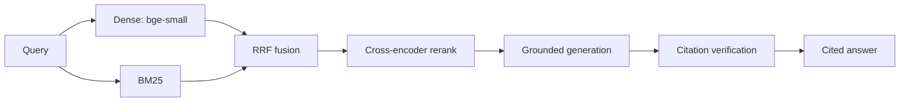

# creative-rag

**Hybrid-retrieval, citation-verified RAG over a craft/style corpus.**

## [Evaluation results](eval/README.md)

| Metric | Score |
|---|---:|
| Retrieval hit@6 | 1.0 |
| MRR | 0.94 |
| nDCG | 0.69 |
| Answer faithfulness | 1.0 |
| Text→SQL execution accuracy | 0.917 (0 safety violations) |
| Tests | 40 tests, CI-green |

## Live demo

🚀 **[Live demo](https://rishbjain-creative-rag.hf.space)** — `GET /health` · `POST /query` · hosted on [HF Spaces](https://huggingface.co/spaces/rishbjain/creative-rag)

```bash
curl -X POST https://rishbjain-creative-rag.hf.space/query \
  -H 'Content-Type: application/json' \
  -d '{"query": "what film stock for a moody dusk scene?", "top_k": 4}'
```

## Why this matters

Hybrid retrieval matters because dense-only misses exact terminology, while BM25-only misses paraphrase. Every answer must cite retrieved chunks, and each citation is verified against its source post-generation, so the system fails loudly instead of hallucinating quietly.

Ask a knowledge base of cinematography + AI-filmmaking notes a real question and
get a **grounded, cited, verified** answer — not a hallucination. Built to be
trustworthy: every claim is checked against the retrieved sources.

```
$ crag query "what film stock and lens for a moody dusk beach scene?"

ANSWER: ... Cinestill 800T (tungsten-balanced, teal shadows) at the day→night
transition [5][6]; 85mm f/1.4 for faces, 14–35mm wide [5]. The notes don't give a
beach-specific lighting recipe — fill direction/sources yourself [2].

SOURCES: [5] craft_library.md §Campaign Lock ... [6] §Film Stocks ...
VERIFY:  {"supported": true, "unsupported_claims": []}
```

## The retrieval funnel

Each stage is cheaper-but-coarser early, expensive-but-sharper late:

```
corpus → chunk (heading-aware) → embed (bi-encoder) → Chroma + BM25

query → dense (vector) ─┐
        sparse (BM25)  ─┴→ RRF fuse → top-30   (fast, approximate, high recall)
                        → cross-encoder rerank → top-6   (precise, joint attention)
                        → augment (rerank order, grounding instruction)
                        → generate (LLM, answer only from notes, cite)
                        → citation-verify (LLM-judge entailment per claim)
```



- **Dense** catches *meaning*, **sparse (BM25)** catches *exact terms* (stock names, `#hex`, `21:9`); **RRF** fuses them scale-free.
- **Cross-encoder rerank** reads query+chunk *together* — disambiguates near-identical-embedding opposites ("use 500T" vs "avoid 500T").
- **Citation-verify** is the eval layer: a second pass flags any claim not grounded in the notes.

## Local models (PyTorch)

Embeddings + reranker run **locally** via `sentence-transformers` — no API, no key,
fully reproducible:
- embed: `BAAI/bge-small-en-v1.5` (bi-encoder)
- rerank: `BAAI/bge-reranker-base` (cross-encoder)

The embedder/reranker live in one module (`embed.py`) behind a clean interface, so
an API backend can swap in without touching retrieval.

## Provider-agnostic generation

Generation + verification go through any **OpenAI-compatible** endpoint —
Anthropic (default), OpenRouter, OpenAI, local — chosen by env. No provider hard-coded.

## Part of the studio trio

creative-rag is the knowledge layer of a three-part AI film pipeline:

- **`ai-content-pipeline` skill** — the method (plan → lock → stills → animate → cut)
- **[studio-mcp](https://github.com/rishbjain1/studio-mcp)** — the tools; its
  `craft_lookup` tool calls this service's `/query` to ground prompts
- **creative-rag** (this repo) — the cited, verified craft knowledge base

Run this service on `:8000` and studio-mcp's `craft_lookup` grounds every prompt in it.
Architecture + the end-to-end smoke test: [studio-mcp/INTEGRATION.md](https://github.com/rishbjain1/studio-mcp/blob/main/INTEGRATION.md).

## Install

```bash
python3 -m venv .venv && source .venv/bin/activate
pip install -e .
cp .env.example .env   # set CRAG_LLM_API_KEY (or ANTHROPIC_API_KEY)
```

## Use

```bash
crag ingest                                  # build the index from the corpus
crag query "what lens for a face close-up?"  # ask it (cited + verified)
creative-rag                                 # serve the FastAPI app (:8000)
```

API:
```
GET  /health                       # liveness + index status
POST /query  {query, top_k, verify}  # grounded answer + sources + verification
```
Set `CRAG_API_KEY` to require an `X-API-Key` header on `/query`.

## Corpus

Defaults to a local craft knowledge base (`CRAG_CORPUS_ROOT`). Ingest is
markdown-aware (chunks on headings) and skips non-craft/derived files. The index
is gitignored — only code is tracked.

## Test

```bash
pytest tests/ -q
```

## Eval

Offline eval harness over a labeled set — measures the retriever (`hit@k`,
`recall@k`, `MRR`, `nDCG@k`) and the generated answer (`correctness`,
`faithfulness`). This is the regression layer on top of the runtime
`citation-verify` guardrail: it tells you whether a change helps or hurts.

```bash
crag-eval --qa eval/qa_craft.jsonl                 # retrieval metrics (no key)
crag-eval --qa eval/qa_craft.jsonl --with-llm      # + generation metrics
crag-eval --qa eval/qa_craft.jsonl --gate          # nonzero exit on regression
```

Labels pin the *answer* (source + phrase), not chunk ids, so they survive a
reingest. CI (`.github/workflows/eval.yml`) ingests a committed sample corpus and
gates retrieval on it every push. Details + baseline: [eval/README.md](eval/README.md).

## Deploy (Docker + Terraform on AWS Fargate)

The service containerizes (PyTorch + bge models + a sample index baked in, so the
image is self-contained) and deploys to ECS Fargate via Terraform (`deploy/`):
ECR + ECS cluster + task + service on the default VPC, with CloudWatch logs.

```bash
# 1. build + push the image
aws ecr create-repository --repository-name creative-rag    # or let terraform make it
docker build -t creative-rag .
aws ecr get-login-password | docker login --username AWS --password-stdin <acct>.dkr.ecr.<region>.amazonaws.com
docker tag creative-rag <acct>.dkr.ecr.<region>.amazonaws.com/creative-rag:latest
docker push <acct>.dkr.ecr.<region>.amazonaws.com/creative-rag:latest

# 2. provision + run
cd deploy
terraform init
terraform apply -var image_tag=latest        # ANTHROPIC_API_KEY via task secret in prod

# 3. tear down (no ongoing cost)
terraform destroy
```

Fargate task CPU/memory default to 1 vCPU / 4GB (torch needs the headroom). The
config is `terraform validate`-clean.

## License

MIT
